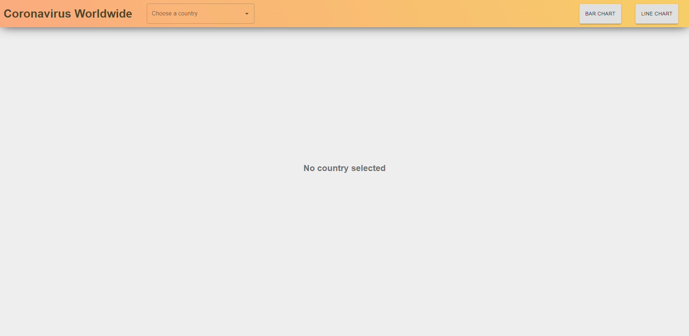

# Coronavirus Worldwide - Recharts

## Info

`Type` - Front-end

`Framework` - React.js

### Central Libraries :

- Recharts
- Material-UI
- Styled-components

This application aims to practice using external libraries and create charts.
This application presents the morbidity data of the corona virus worldwide, in two separate graphs:

**The first chart - the linear char** - shows the total number of patients in the country by date.

**The second chart - the bar char** - shows the number of patients per month.

The information is taken from this [source](https://raw.githubusercontent.com/CSSEGISandData/COVID-19/master/csse_covid_19_data/csse_covid_19_time_series/time_series_covid19_confirmed_global.csv). This is an original Excel file that through this link we get a JSON file. In the `App.js` component I handle the data and convert it into an array of objects.

## Demo

https://recharts.vercel.app/

## Simulation

